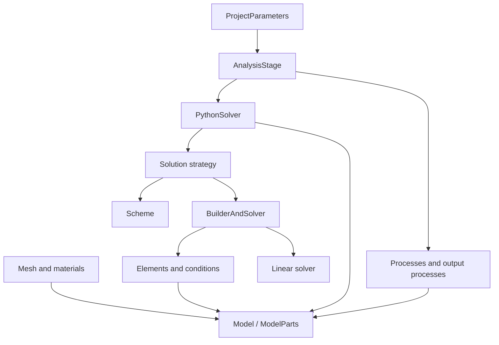

# Kratos Multiphysics Python tutorial

Kratos is a framework for building simulation software. It provides common data structures, finite-element assembly, linear algebra, parallel infrastructure, input/output, and a Python orchestration layer. Physics is supplied by Applications such as StructuralMechanicsApplication and ConvectionDiffusionApplication.

This guide explains that framework from the ground up. The examples stay small enough to inspect by hand, but they use the same interfaces as larger Kratos analyses. Each complete numerical example is checked against an analytical result. The point is to understand what Kratos constructs and solves, not to learn a collection of JSON files by imitation.

The material is intended to live beside a Kratos checkout or installation. It does not assume a particular operating system, package manager, Python environment name, or binary distribution.

## Prerequisites

You should be comfortable with basic Python: modules, classes, loops, dictionaries, and reading files. Familiarity with vectors, matrices, and the finite-element method is useful. The guide derives the equations needed for its examples, but it is not a general course in continuum mechanics or numerical PDEs.

The runnable examples require a Kratos build or installation containing:

- KratosMultiphysics Core;
- StructuralMechanicsApplication;
- ConvectionDiffusionApplication.

Installation and compilation depend on the platform and the Applications required by a project. Follow the [installation instructions from the same Kratos revision](https://github.com/KratosMultiphysics/Kratos/blob/master/INSTALL.md), then return here once `import KratosMultiphysics` succeeds. This guide starts at that interface boundary rather than prescribing one package manager or build configuration.

Use the Python interpreter for which Kratos was built. Check it before starting:

```bash
python3 -c "import KratosMultiphysics as KM; print(KM.Kernel.Version())"
```

If your build uses a launcher or a virtual environment, substitute its Python command for `python3` throughout the guide.

## Run the guide

Run one example from the directory containing this README:

```bash
python3 tutorial/00_orientation/check_installation.py
```

Run every executable example and integration test:

```bash
python3 run_all.py
```

Add `--verbose` to print the captured Kratos logs:

```bash
python3 run_all.py --verbose
```

`run_all.py` launches every example with the same interpreter used to launch the runner. This avoids mixing Kratos installations accidentally.

## Reading order: 0 to 100

The chapters are cumulative. Chapters 00–04 explain the data model and input. Chapters 05–09 explain how equations are built, solved, and customized. Chapters 10–12 cover the work needed to make simulations maintainable and defensible.

| Level | Chapter | Main program | Subject |
|---:|---|---|---|
| 0 | [00 — Runtime and Applications](tutorial/00_orientation/README.md) | `check_installation.py` | Python/Kratos compatibility, Core, and Application registration |
| 10 | [01 — Model and ModelParts](tutorial/01_model_and_modelparts/README.md) | `model_and_modelparts.py` | Ownership, groups, nodes, elements, conditions, and properties |
| 20 | [02 — Variables and time](tutorial/02_variables_and_time/README.md) | `variables_and_time.py` | Typed variables, historical storage, buffers, DOFs, flags, and `ProcessInfo` |
| 30 | [03 — Parameters](tutorial/03_parameters/README.md) | `parameters.py` | Typed JSON configuration, validation, defaults, and mutation |
| 40 | [04 — MDPA input](tutorial/04_mdpa_io/README.md) | `read_mdpa.py` | Reconstructing a ModelPart from text input |
| 50 | [05 — Local and global equations](tutorial/05_elements_and_linear_systems/README.md) | `inspect_truss_element.py`, `assemble_and_solve.py` | Local systems, assembly, constraints, sparse matrices, and the solver stack |
| 60 | [06 — Structural analysis](tutorial/06_complete_structural_analysis/README.md) | `run_analysis.py`, `run_nonlinear_analysis.py` | Complete linear and finite-deformation analyses with analytical checks |
| 70 | [07 — Processes](tutorial/07_processes/README.md) | `run_with_process.py` | Reusable behavior at defined points in the simulation lifecycle |
| 75 | [08 — Custom AnalysisStage](tutorial/08_custom_analysis_stage/README.md) | `monitoring_analysis.py` | Changing orchestration without copying application code |
| 80 | [09 — Heat diffusion](tutorial/09_heat_diffusion/README.md) | `run_heat_problem.py` | Applying the same framework to another PDE and Application |
| 90 | [10 — Output, tests, and performance](tutorial/10_output_testing_performance/README.md) | VTK runner and integration tests | Verification, regression tests, output, diagnostics, threading, and profiling |
| 95 | [11 — Architecture and extension](tutorial/11_architecture_and_extension/README.md) | `inspect_runtime.py` | Registries, factories, C++/Python boundaries, restart, parallelism, and new components |
| 100 | [12 — Capstone](tutorial/12_capstone/README.md) | `parameter_sweep.py` | Turning a verified case into a reproducible numerical study |

Two appendices continue beyond the linear reading order:

| Appendix | Subject | Use it when |
|---|---|---|
| [A — ProjectParameters in depth](appendices/A_project_parameters/README.md) | Parameter ownership, types, defaults, solver and process configuration, paths, debugging, reproducibility, and multistage projects | You need to author, review, generate, or diagnose a real Kratos configuration |
| [B — FlowGraph](appendices/B_flowgraph/README.md) | Visual configuration, graph artifacts, import/export, multistage output, validation, limitations, and extension | You want to construct ProjectParameters as a visual workflow |

## The parts of a Kratos analysis

The following separation is the most useful way to reason about a case:



- `Model` is the top-level container for a simulation.
- `ModelPart` stores the mesh entities, properties, solution data, groups, and step-wide state.
- Elements and conditions calculate local contributions to the discrete equations.
- A scheme defines unknown updates and, where applicable, time integration.
- A builder and solver numbers DOFs, assembles the global system, applies constraints, and invokes a linear solver.
- A strategy controls a linear solve or nonlinear iteration.
- A `PythonSolver` configures that stack for one field or coupled problem.
- Processes apply boundary conditions, loads, initialization, checks, monitoring, and output.
- An `AnalysisStage` controls initialization, the solution loop, process calls, output, and finalization.

This division tells you where to look when something is wrong. A missing element name is a registration/input problem. A singular matrix is usually a model, DOF, or constraint problem. Slow nonlinear convergence belongs to the formulation, strategy, convergence criteria, load stepping, or scaling—not to the output process.

The architecture and lifecycle described here apply across Applications. Names such as `TrussLinearElement3D2N`, `LaplacianElement2D3N`, `POINT_LOAD`, and `CONDUCTIVITY` belong to the worked examples. For another Application, replace those components with ones whose documentation, defaults, and specifications match the governing equations and discretization; do not transfer a component name merely because its geometry has the same number of nodes.

## Structure of a complete case

The full examples use a conventional layout:

```text
case/
├── ProjectParameters.json  # solver, time loop, processes, and output
├── Materials.json          # material and section properties
└── model.mdpa              # nodes, connectivity, property IDs, and groups
run_analysis.py             # creates Model and AnalysisStage, runs, checks results
```

Kratos supports other input and modeling workflows. This layout is used because every piece is visible and easy to test.

## Conventions used here

- Commands are written as `python3`; use the interpreter associated with your Kratos build.
- Paths in the example programs are derived from `__file__`, so programs can be launched from another working directory.
- SI units are used in the examples. Kratos does not enforce units; the input must be internally consistent.
- Generated output is confined to `tutorial/10_output_testing_performance/generated/`.
- Numerical examples contain assertions against independent results.
- Examples are ordinary Python files rather than notebooks. This makes execution order explicit and lets the same files run in a terminal, debugger, test suite, or continuous-integration job.

## How to use each chapter

Read the explanation, predict the example result, run it unchanged, and then work through the exercises. When modifying a case, change one assumption at a time and add a check for the expected effect. Keep the supplied small cases intact as regression tests.

The [glossary](GLOSSARY.md) defines Kratos terminology. [Sources and version policy](SOURCES.md) lists the corresponding Kratos documentation and explains how to resolve differences between releases.
