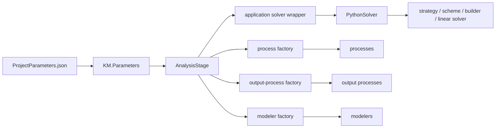

# Appendix A — `ProjectParameters.json` in depth

`ProjectParameters.json` is the control plane of a Kratos analysis. It selects the simulation driver, solver family, mesh and material inputs, numerical algorithms, boundary conditions, loads, output, and often the path by which the model is constructed. When a case starts incorrectly, the cause is often visible here before any equation is assembled.

The central fact is easy to miss:

> `ProjectParameters.json` is a convention, not a single universal schema.

Kratos reads the file into a generic `KratosMultiphysics.Parameters` tree. The AnalysisStage, solver wrapper, concrete solver, factories, processes, modelers, and output processes each consume and validate the part they own. An option can be valid in one Application, solver, or release and invalid in another.

This appendix gives you a method for understanding any ProjectParameters file from the code that runs it. It uses the small structural and thermal cases in this guide as examples, but it does not present their component names as universal Kratos settings.

## Run the inspector

The companion program summarizes either a conventional single-stage file or a multistage file:

```bash
python3 appendices/A_project_parameters/inspect_project_parameters.py
```

Inspect another file by passing its path:

```bash
python3 appendices/A_project_parameters/inspect_project_parameters.py path/to/ProjectParameters.json
```

The inspector parses with `KM.Parameters`, identifies the layout, reports the consumers selected by the file, lists process groups, and checks input paths relative to the file. It is an orientation tool, not a substitute for component validation or a simulation run.

## 1. From JSON text to running objects

A conventional entry point is small:

```python
from pathlib import Path

import KratosMultiphysics as KM
from KratosMultiphysics.StructuralMechanicsApplication.structural_mechanics_analysis import (
    StructuralMechanicsAnalysis,
)

case_dir = Path(__file__).resolve().parent
parameters = KM.Parameters(
    (case_dir / "ProjectParameters.json").read_text(encoding="utf-8")
)
model = KM.Model()
analysis = StructuralMechanicsAnalysis(model, parameters)
analysis.Run()
```

The JSON file does not execute Python by itself. The entry point chooses an AnalysisStage class and passes it a `Parameters` object. The stage and its collaborators then interpret the tree.



This is why searching for a mythical complete schema is frustrating. The effective schema is composed from several consumers.

## 2. Who owns each block?

The following table is more useful than memorizing a sample file.

| Block or value | Typical consumer | What to inspect |
|---|---|---|
| `problem_data` | base or derived AnalysisStage; solver wrapper | AnalysisStage constructor and initialization; application analysis class |
| `parallel_type` | AnalysisStage and application solver wrapper | wrapper that selects OpenMP/MPI solver modules |
| `solver_settings.solver_type` | application solver wrapper | `python_solvers_wrapper_*.py` or the analysis `_CreateSolver()` method |
| remaining `solver_settings` | selected concrete `PythonSolver` | `GetDefaultParameters()`, `ValidateSettings()`, and creation methods |
| `model_import_settings` | selected solver or modeler | solver import method and the relevant I/O/modeler class |
| `material_import_settings` | selected solver | material-reading code in the Application solver |
| `linear_solver_settings` | linear-solver factory and selected linear solver | factory plus the registered linear solver implementation |
| `processes` | AnalysisStage, then process factory, then each process | process initialization order, factory convention, process defaults |
| `output_processes` | AnalysisStage and output-process factory | output class defaults and scheduling methods |
| `modelers` | AnalysisStage or multistage preprocess | model-parameters factory and each modeler |
| `orchestrator` and `stages` | multistage `Project` and orchestrator | orchestrator class, stage factory, and each nested AnalysisStage |

Ownership explains several otherwise puzzling behaviors:

- `solver_type` may be consumed before the concrete solver is created, so the concrete solver's defaults need not list every wrapper alias.
- Process-list names are not a universal enumeration at the base AnalysisStage level. The stage iterates groups and may impose an initialization order for selected names.
- A nested block may be validated later by another factory. Top-level validation does not prove that every nested option is valid.
- Two Applications can use the same key with different allowed values because different code consumes it.

## 3. The conventional single-stage shape

Most tutorial and production cases instantiate one application AnalysisStage directly. Their common shape is:

```json
{
    "problem_data": {},
    "solver_settings": {},
    "processes": {},
    "output_processes": {}
}
```

Optional top-level sections include `modelers` and Application-specific settings. Some entry points also read an `analysis_stage` string from the file; other entry points import a particular AnalysisStage in Python, making such a field unnecessary. The entry point is the authority.

The complete structural example is [the one-bar ProjectParameters file](../../tutorial/06_complete_structural_analysis/case/ProjectParameters.json). Trace it in this order:

1. `problem_data.parallel_type` and `solver_settings.solver_type` select the serial static structural solver path.
2. `model_part_name` names the root ModelPart that the solver creates or retrieves.
3. `model_import_settings` locates the MDPA mesh.
4. `material_import_settings` locates the material file that fills properties.
5. the solver adds its variables and DOFs, prepares the computing ModelPart, and constructs the numerical stack;
6. constraint processes fix displacement components on named SubModelParts;
7. the load process assigns `POINT_LOAD` on the load SubModelPart;
8. the AnalysisStage advances to the configured end time and solves;
9. output processes, if present, decide whether to write that step.

Every referenced name crosses a boundary. `Structure.LoadPoint` must exist after model import. `POINT_LOAD` must be registered and have the type expected by the process. The chosen condition must turn that data into a right-hand-side contribution. A syntactically valid file proves none of these relationships.

## 4. `problem_data`

A common block is:

```json
{
    "problem_name": "one_bar_truss",
    "parallel_type": "OpenMP",
    "start_time": 0.0,
    "end_time": 1.0,
    "echo_level": 1
}
```

### `problem_name`

This is normally an identifier used in logs or output names. Do not assume it selects the MDPA file; that responsibility normally belongs to `model_import_settings.input_filename`.

### `parallel_type`

This often participates in solver dispatch. `OpenMP` and `MPI` are not cosmetic labels. The selected wrapper may import a different solver module, require different Applications, and expect different linear solvers. The value must agree with how Kratos was launched.

### `start_time` and `end_time`

The AnalysisStage uses these to initialize and stop its loop. A static analysis can still have a time loop: pseudo-time is useful for applying intervals, ramping loads, producing steps, and controlling incremental nonlinear solves. “Static” describes the governing equilibrium, not necessarily a one-call program.

The usual loop condition is `current_time < end_time`. The solver's `AdvanceInTime()` determines the next value, commonly from `solver_settings.time_stepping`. Check whether the final step can overshoot `end_time` for the solver being used.

### `echo_level`

Echo levels control diagnostics, but the exact meaning is component-specific. In the base AnalysisStage, a sufficiently high echo level can also write expanded project parameters after initialization. Do not rely on one numeric level having identical output across all solvers and processes.

## 5. `solver_settings`: selection before configuration

Treat solver settings in two layers.

### Layer 1: solver dispatch

The application AnalysisStage usually calls a wrapper. The wrapper reads a small set of values—often `solver_type`, `parallel_type`, and sometimes a time-integration choice—to select and import a concrete Python solver module.

For example, a structural wrapper may map `"static"` under `"OpenMP"` to a static mechanical solver and the same solver type under `"MPI"` to its Trilinos counterpart. A custom string may be treated as an importable Python module.

This dispatch is Application-specific. Never assume that `"static"`, `"stationary"`, `"monolithic"`, or `"fractional_step"` are interchangeable names.

### Layer 2: concrete solver configuration

The selected solver then owns settings such as:

- the main and computing ModelPart names;
- domain size and buffer size;
- mesh and material import;
- time stepping and time integration;
- linear or nonlinear analysis mode;
- convergence criteria and tolerances;
- maximum nonlinear iterations;
- scheme, builder-and-solver, and strategy options;
- reaction computation and mesh motion;
- auxiliary variables and DOFs.

The authoritative starting point is the selected class's `GetDefaultParameters()`:

```python
from KratosMultiphysics.StructuralMechanicsApplication.structural_mechanics_static_solver import (
    StaticMechanicalSolver,
)

print(StaticMechanicalSolver.GetDefaultParameters().PrettyPrintJsonString())
```

Use the class selected by your wrapper and the same Kratos revision as the run. Defaults from a base class, a different solver, or online documentation for another revision are only partial evidence.

### `model_part_name`

This names a ModelPart in `KM.Model`, not a filename. A solver may create it if absent or retrieve an existing one. Names with dots refer to nested SubModelParts only after the root ModelPart exists.

### `domain_size`

This tells formulations whether the physical problem is two- or three-dimensional. It does not infer element topology and does not repair a mismatch between the selected element and the MDPA connectivity.

### `analysis_type`

This often chooses linear versus nonlinear solution behavior inside one solver family. It is distinct from the wrapper-level `solver_type`. A static nonlinear analysis is entirely coherent: static equilibrium is solved with nonlinear iterations.

### `model_import_settings`

A common MDPA import is:

```json
{
    "input_type": "mdpa",
    "input_filename": "truss"
}
```

Many MDPA readers expect the base path without `.mdpa`; the selected import utility decides. Restart and modeler-based workflows use other values and additional settings.

Relative paths are normally interpreted relative to the process working directory, not relative to the JSON file automatically. A robust Python entry point either runs with a documented working directory or replaces file settings with absolute paths derived from `__file__`. Every runnable case in this guide uses the latter approach.

### `material_import_settings`

This points the selected solver to a materials file. It does not guarantee that:

- every property ID used by an element has a matching material definition;
- a constitutive law is compatible with the element;
- variable names are registered;
- values use consistent units.

Those checks occur later, and some are necessarily physical rather than structural.

### `time_stepping`

The simplest form is:

```json
{"time_step": 0.1}
```

Other solvers support automatic steps, tables, CFL-based controls, or Application-specific controllers. The time-step size controls more than output density. It affects load increments, integration error, nonlinear convergence, contact changes, and stability.

### `linear_solver_settings`

The linear solver handles the assembled algebraic problem. Typical settings identify an implementation and may add tolerances, iteration limits, preconditioners, scaling, reordering, or verbosity.

```json
{
    "solver_type": "skyline_lu_factorization"
}
```

Availability depends on compiled Applications and the execution mode. A direct solver that is convenient for a tiny verification case may be unsuitable for a large sparse model. Conversely, an iterative solver adds convergence and preconditioning choices that should be verified, not copied blindly.

### Nonlinear controls

Keep these concepts separate:

- the nonlinear strategy decides the iteration algorithm;
- the convergence criterion decides when an iterate is accepted;
- relative tolerances scale against a reference norm;
- absolute tolerances provide a floor when that reference is small;
- `max_iteration` prevents an endless failed step;
- the linear solver solves each linearized system.

A run that reaches the maximum iteration count has not been repaired by loosening a tolerance unless the new tolerance has a defensible error meaning.

### Reactions and mesh movement

`compute_reactions` requests values conjugate to constrained DOFs when the strategy supports them. It is useful for equilibrium checks but can add work.

`move_mesh_flag` controls whether coordinates are updated from displacement during the solution. It is not the same as selecting a geometrically nonlinear element formulation. Understand both the kinematics and the visualization consequence.

## 6. Processes: configuration that runs on the lifecycle

Processes add behavior without copying an AnalysisStage. A typical descriptor uses the longstanding Python factory form:

```json
{
    "python_module": "assign_vector_variable_process",
    "kratos_module": "KratosMultiphysics",
    "Parameters": {
        "model_part_name": "Structure.LoadPoint",
        "variable_name": "POINT_LOAD",
        "constrained": false,
        "value": [1000.0, 0.0, 0.0],
        "interval": [0.0, "End"]
    }
}
```

The factory imports the module, calls its `Factory(...)` function, and passes the nested `Parameters` block to the process. Current Kratos code also supports registry-based descriptors with a `name` and `parameters`/`Parameters` block. Use the convention supported by the target component and revision; do not mix fields casually.

### Process groups

Under the common interface, `processes` is an object whose values are arrays:

```json
{
    "processes": {
        "constraints_process_list": [],
        "loads_process_list": [],
        "auxiliary_process_list": []
    }
}
```

The base AnalysisStage constructs selected groups in an order returned by the derived stage and then constructs remaining groups in declaration order. Some Applications recognize conventional group names for backward compatibility or ordering. Preserve the conventions of the selected AnalysisStage, especially when one process depends on another.

### Process lifecycle

Constructing a process is only the beginning. The AnalysisStage calls process methods at defined points:

| Stage event | Typical purpose |
|---|---|
| `ExecuteInitialize` | validate and initialize after the model is prepared |
| `ExecuteBeforeSolutionLoop` | establish values needed before the first step |
| `ExecuteInitializeSolutionStep` | apply time-dependent values, constraints, or loads |
| `ExecuteFinalizeSolutionStep` | collect or update data after a converged step |
| `ExecuteBeforeOutputStep` | prepare derived output quantities |
| `ExecuteAfterOutputStep` | clean up after writing |
| `ExecuteFinalize` | close resources and finish summaries |

Read the process implementation to learn which hooks it overrides. A value process may assign data before every step; another process may operate only once.

### `model_part_name`

The referenced ModelPart must exist when the process is constructed. With a conventional AnalysisStage, model import and preparation happen before process construction. A typo such as `Structure.Loadpoint` is not a harmless label difference.

### `variable_name`

The variable must be registered by Core or an imported Application and must have the type expected by the process. `TEMPERATURE` is scalar; `DISPLACEMENT` is a three-component array; `DISPLACEMENT_X` is a scalar component. The solver must also allocate historical storage when a process writes a historical nodal value.

### `constrained`

For assignment processes, this often controls whether the corresponding DOF is fixed as well as assigned. A prescribed value and an unconstrained load are different operations even when both are represented by numeric vectors.

### `interval`

Intervals gate process behavior in simulation time. `"End"` is a semantic string understood by interval-aware Kratos utilities; it is not a JSON keyword. Confirm endpoint inclusion when switching a condition exactly at a boundary.

### Expression strings

Some input processes accept strings such as `"2.0*t"` or expressions of space and time. The process, not JSON and not `KM.Parameters`, interprets the expression. Only use names and syntax documented by that process.

## 7. Output processes

`output_processes` has the same outer organization as regular processes, but its objects derive from output-process interfaces and take part in scheduling:

```json
{
    "output_processes": {
        "vtk_output": [{
            "python_module": "vtk_output_process",
            "kratos_module": "KratosMultiphysics",
            "Parameters": {
                "model_part_name": "ThermalDomain",
                "output_control_type": "step",
                "output_interval": 1,
                "nodal_solution_step_data_variables": ["TEMPERATURE"]
            }
        }]
    }
}
```

An output process normally implements `IsOutputStep()` and `PrintOutput()`. Distinguish:

- output control by step versus by physical time;
- output interval from solver time step;
- historical nodal results from nonhistorical nodal data;
- nodal results from integration-point results;
- root ModelPart output from selected SubModelParts;
- deformed coordinates from reference coordinates.

Output is part of the verification design. Write only what is needed, at a cadence that can reveal the behavior of interest. Excessive output can dominate runtime and storage.

## 8. Modelers

Modelers construct or transform the model before the solver imports or prepares its computational ModelPart. In a conventional AnalysisStage, the three modeler phases are called in this order across the whole list:

1. `SetupGeometryModel()` for every modeler;
2. `PrepareGeometryModel()` for every modeler;
3. `SetupModelPart()` for every modeler.

That list-wise ordering lets several modelers cooperate on a shared geometry. Modern descriptors are commonly constructed through `KratosModelParametersFactory`:

```json
{
    "name": "Modelers.KratosMultiphysics.ImportMDPAModeler",
    "parameters": {}
}
```

The exact registry name and settings are revision-specific. Inspect the modeler defaults and the registration list. In a multistage project, modelers belong in a stage's `stage_preprocess`, not its postprocess.

## 9. `KM.Parameters` is typed JSON, not a Python dictionary

JSON provides objects, arrays, strings, numbers, booleans, and null. `KM.Parameters` preserves that structure and adds typed access, mutation, validation, cloning, and formatted output.

```python
settings = KM.Parameters(r'''{
    "echo_level": 1,
    "time_step": 0.1,
    "enabled": true,
    "labels": ["inlet", "outlet"]
}''')

echo = settings["echo_level"].GetInt()
dt = settings["time_step"].GetDouble()
enabled = settings["enabled"].GetBool()
labels = settings["labels"].GetStringArray()
```

Use `IsInt`, `IsDouble`, `IsNumber`, `IsString`, `IsBool`, `IsArray`, `IsSubParameter`, and `IsNull` when input may have more than one supported form.

Kratos numeric validation normally treats integer and floating-point JSON numbers as compatible numeric types. Typed retrieval still matters: ask for the type promised by the component interface.

Although the Kratos parser accepts comments in some contexts, comments are not part of standard JSON. Files with comments can fail in `python -m json.tool`, FlowGraph, web tools, and other preprocessors. Keep shared ProjectParameters files as strict JSON. Put explanations in README files or adjacent metadata.

## 10. Views, copies, and mutation

Indexing returns a view into the same parameter tree:

```python
solver_settings = parameters["solver_settings"]
solver_settings["echo_level"].SetInt(2)
```

The original `parameters` now contains the new value. Clone before building variants:

```python
variant = parameters.Clone()
variant["solver_settings"]["echo_level"].SetInt(0)
```

Useful mutation methods include:

```python
settings.AddString("label", "case-a")
settings.AddInt("max_iteration", 20)
settings.AddBool("compute_reactions", True)
settings.AddEmptyArray("variables")
settings["variables"].Append("TEMPERATURE")
settings.RemoveValue("deprecated_option")
```

`AddValue` inserts a Parameters subtree. Be conscious of view/copy semantics when reusing a subtree in multiple variants; `Clone()` makes intent explicit.

## 11. Defaults and validation: shallow and recursive are different

This distinction matters in real solver code.

```python
user = KM.Parameters(r'''{
    "echo_level": 1,
    "advanced": {}
}''')

defaults = KM.Parameters(r'''{
    "echo_level": 0,
    "advanced": {
        "scaling": true
    }
}''')

user.ValidateAndAssignDefaults(defaults)
```

`ValidateAndAssignDefaults` validates and fills the current object level. Because `advanced` already exists as an object, its missing child is not added by this call.

```python
user.RecursivelyValidateAndAssignDefaults(defaults)
```

The recursive form descends into `advanced`, adds `scaling`, and rejects unexpected nested keys.

Related methods have deliberately different policies:

| Method | Rejects unexpected keys | Adds missing values | Descends into existing nested objects |
|---|---:|---:|---:|
| `ValidateDefaults` | yes | no | no |
| `ValidateAndAssignDefaults` | yes | yes | no |
| `AddMissingParameters` | no | yes | no |
| `RecursivelyValidateDefaults` | yes | no | yes |
| `RecursivelyValidateAndAssignDefaults` | yes | yes | yes |
| `RecursivelyAddMissingParameters` | no | yes | yes |

Do not automatically choose the recursive form because it sounds more thorough. A parent component may intentionally leave a nested block to a child factory with its own schema. Recursively validating that block against an empty parent default could reject every valid child option. Follow the ownership boundary in the implementation.

An “unexpected parameter” error commonly means one of four things:

1. a spelling error;
2. an option at the wrong nesting level;
3. settings copied from a different solver or Application;
4. settings copied from a different Kratos revision.

Removing validation to silence the error destroys useful information.

## 12. Find the effective defaults

Use this sequence when a setting is unclear:

1. identify the Python entry point or multistage orchestrator;
2. inspect the AnalysisStage `_CreateSolver()` method;
3. inspect the application solver wrapper to resolve `solver_type` and `parallel_type`;
4. call or read the selected solver's `GetDefaultParameters()`;
5. inspect `ValidateSettings()` for separately validated sub-blocks;
6. follow factories for the linear solver, processes, modelers, and outputs;
7. inspect each selected component's defaults;
8. read tests and examples from the same revision;
9. run a minimal verified case.

For a programmatic look at defaults:

```python
defaults = SelectedSolver.GetDefaultParameters()
print(defaults.PrettyPrintJsonString())
```

Remember that default assignment mutates the user settings held by the solver. If you need the original input for an audit, clone it before constructing the stage.

## 13. File paths and the working directory

Configuration files often contain several path conventions at once:

- an MDPA base path without `.mdpa`;
- a material filename with `.json`;
- an output path that may be a base name or directory;
- restart/checkpoint paths;
- table or auxiliary-data files consumed by processes.

Do not assume all are resolved by one utility. Each consumer handles its own path.

Two robust deployment patterns are common:

### Defined working directory

The case layout is fixed and the launcher changes into the case directory before running. This works well for archived standalone cases, but the working-directory requirement must be documented and enforced.

### Absolute injection at the entry point

The checked-in JSON contains portable case-relative names. The entry point derives absolute paths from its own location and mutates a cloned Parameters tree before constructing Kratos objects. This guide uses that pattern so tests can run from any directory.

Never resolve input paths from the user's current shell directory silently and then archive the unresolved JSON as if it were self-contained.

## 14. Units and physical meaning

Kratos does not attach dimensions to ordinary numeric parameters. The model must use one coherent unit system. A valid JSON type cannot distinguish pascals from megapascals or seconds from milliseconds.

Record at least:

- base units;
- sign and coordinate conventions;
- whether loads are total, per length, per area, or per volume;
- whether densities are mass or weight densities;
- whether angles are degrees or radians;
- whether output is in reference or deformed coordinates.

Parameter names alone are often insufficient. Put the unit contract in the case README and test a dimensional analytical result.

## 15. Conventional versus multistage ProjectParameters

Current Kratos also supports projects that run several AnalysisStages through an orchestrator. The outer shape is different:

```json
{
    "orchestrator": {
        "name": "Orchestrators.KratosMultiphysics.SequentialOrchestrator",
        "settings": {
            "execution_list": ["stage_a", "stage_b"],
            "stage_checkpoints": false,
            "load_from_checkpoint": null
        }
    },
    "stages": {
        "stage_a": {
            "stage_preprocess": {},
            "stage_postprocess": {},
            "stage_settings": {
                "analysis_stage": "package.module_name",
                "problem_data": {},
                "solver_settings": {},
                "processes": {},
                "output_processes": {}
            }
        }
    }
}
```

The familiar single-stage blocks now live under each stage's `stage_settings`. The outer `Project` owns one shared `Model`, stage output data, active stages, and checkpoint state. An orchestrator determines the order and handles preprocess/postprocess operations around each stage.

For the sequential orchestrator:

- `execution_list` names stages in run order; if omitted in supported revisions, declaration order may be used;
- `stage_checkpoints` can disable checkpoints, enable all of them, or select stage names where supported;
- `load_from_checkpoint` is null or a checkpoint path;
- stage preprocess may contain modelers and operations;
- stage postprocess may contain operations, but modelers belong in the next stage's preprocess;
- the same `Model` lets later stages see ModelParts and data left by earlier stages, provided their contracts are compatible.

The two shapes require different launchers. Passing the outer multistage tree directly to `StructuralMechanicsAnalysis` fails because it expects `problem_data` and `solver_settings` at its own root. Passing a conventional single-stage tree to `Project` fails because the orchestrator expects `orchestrator` and `stages`.

[Appendix B](../B_flowgraph/README.md) uses a runnable sequential project because FlowGraph currently generates this multistage envelope.

## 16. Configuration generation and studies

For parameter sweeps, keep one pristine base tree and clone per case:

```python
base = read_parameters()

for load in loads:
    case = base.Clone()
    case["processes"]["loads_process_list"][0]["Parameters"]["value"][0].SetDouble(load)
    run_case(case)
```

Add controls that make the study defensible:

- a stable case identifier derived from the varied values;
- a clean output directory per case;
- the exact resolved parameters saved beside results;
- Kratos version/build information;
- success, convergence, and physical checks;
- a summary table produced from results rather than log scraping;
- no shared mutable Parameters or Model between independent cases unless reuse is deliberate.

JSON text replacement is fragile. It can change the wrong occurrence and bypass typed intent. Mutate the parsed tree at a known path.

## 17. A startup debugging map

The point of failure tells you which ownership boundary to inspect.

| Failure point | Likely questions |
|---|---|
| JSON parse | Is the file strict JSON? Are quotes, commas, booleans, and null correct? |
| typed access | Is the value at the expected path and of the promised type? |
| defaults validation | Is a key misspelled, misplaced, stale, or owned by a child component? |
| solver dispatch/import | Is `solver_type` valid for this Application and parallel mode? Is the Application installed? |
| model import | Is the path resolved correctly? Are entity names registered? Is connectivity valid? |
| material import | Do property IDs, variables, and constitutive laws match the formulation? |
| process construction | Does the ModelPart exist? Is the process module/registry name correct? Is the variable registered? |
| solver initialization | Are DOFs, constraints, elements, and solver components compatible? |
| first linear solve | Is the system constrained and scaled? Is the linear solver available? |
| nonlinear iteration | Are increments, formulation, tolerances, and material parameters defensible? |
| output | Are requested variables allocated and available at the requested location? |

Read the full traceback from its first relevant frame. The last line states the symptom; the frames show which component owned the rejected data.

## 18. Review checklist

Before accepting a ProjectParameters file, answer all of these:

### Structure and ownership

- Which Python entry point, AnalysisStage, or orchestrator consumes the root?
- Which exact solver class does the wrapper select?
- Do all options appear at the level expected by their owner?
- Were defaults taken from the same Kratos revision?

### Model and physics

- Do ModelPart and SubModelPart names exist after import?
- Are element, condition, variable, and constitutive-law names registered?
- Do property IDs and materials match?
- Is the unit system recorded and consistent?
- Are the domain size and formulation compatible with the mesh?

### Numerics

- Are time steps or load increments justified?
- Are convergence criteria and tolerances meaningful for the scale of the problem?
- Is the linear solver suitable and available in the target build?
- Are reactions, mesh movement, and nonlinear controls intentional?

### Processes and output

- Does process construction order satisfy dependencies?
- Are intervals and expression strings interpreted as intended?
- Are essential conditions sufficient without overconstraining the model?
- Does output contain the quantities needed for verification at a sensible cadence?

### Reproducibility

- Are paths portable or made absolute deliberately?
- Is the resolved settings tree archived?
- Is the Kratos revision/build recorded?
- Does a small analytical or benchmark check pass?
- Can the case run from a clean working directory?

## 19. Practice investigations

Work on copies of the guide's cases.

1. Ask the inspector to summarize the structural and thermal ProjectParameters files. Explain every difference as an ownership or physics choice.
2. Print the defaults of the selected structural static solver. Identify which values were supplied explicitly and which are inserted during construction.
3. Add an unknown key at the top of `solver_settings`, then add one inside a separately validated nested block. Compare the two tracebacks.
4. Run the truss entry point from another working directory and explain why its absolute-path injection succeeds.
5. Change the load process interval so it excludes the solved step. Predict and verify the displacement.
6. Replace the direct linear solver only after confirming the alternative is registered. Compare residual and runtime information, not just final displacement.
7. Wrap a conventional case in the multistage envelope by hand, then run the example from Appendix B. Identify which tree is passed to the inner AnalysisStage.

When you can trace a value from JSON path to Python consumer to numerical consequence, you understand ProjectParameters. Memorizing a large specimen is not the same skill.

Next: [Appendix B — FlowGraph](../B_flowgraph/README.md).
