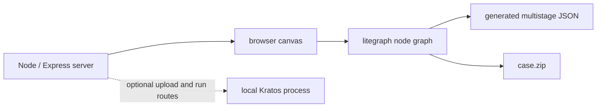
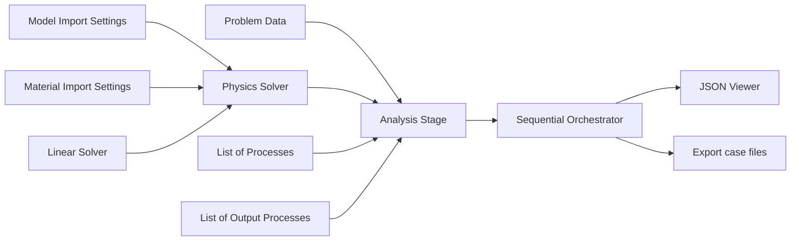

# Appendix B — FlowGraph

[Kratos FlowGraph](https://github.com/KratosMultiphysics/Flowgraph) is a browser-based node editor for constructing Kratos configuration. Instead of writing one nested JSON tree directly, you create nodes for analysis stages, solvers, processes, materials, model parts, and output, then connect the nodes that depend on one another. FlowGraph executes that graph and emits ProjectParameters data.

FlowGraph is useful because it makes configuration dependencies visible. It does not remove the need to understand ProjectParameters. The generated JSON still has to match the target Kratos revision, mesh, materials, Applications, and physical model.

This appendix was reviewed against the official FlowGraph repository at commit `cfa6b34f2554fd93897443033ee7fc40a8951095` (2026-07-14), whose package version is `1.0.0`. FlowGraph evolves independently from Kratos. Recheck the [current documentation](https://kratosmultiphysics.github.io/Flowgraph/) and source when using another revision.

## Run the multistage example first

FlowGraph currently emits Kratos's multistage shape: an `orchestrator` plus one or more entries under `stages`. The example in this appendix runs that shape without requiring the editor:

```bash
python3 appendices/B_flowgraph/run_multistage_project.py
```

It solves the same one-bar truss used in Chapter 06 and checks the displacement and reaction. Compare its [multistage ProjectParameters](case/ProjectParameters.json) with the [conventional single-stage file](../../tutorial/06_complete_structural_analysis/case/ProjectParameters.json).

The important nesting change is:

```text
conventional case                      multistage / FlowGraph case
-----------------                      ---------------------------
problem_data                 ┐         orchestrator
solver_settings              ├ stage   stages
processes                    │           one_bar
output_processes             ┘             stage_settings
                                                analysis_stage
                                                problem_data
                                                solver_settings
                                                processes
                                                output_processes
```

## 1. What FlowGraph is

The current application has three layers:



- A small Node/Express application serves one EJS page and static JavaScript.
- A vendored litegraph engine manages the canvas, nodes, slots, links, and execution order.
- JavaScript modules under `public/js/nodes/` define Kratos-specific nodes.
- Clicking **Generate** runs one graph execution step. Each node reads its inputs, builds a JSON fragment, and publishes its outputs.
- Sink nodes show, download, or send the final data.

There is no front-end build step. The server discovers node modules from the node directory and injects them into the page. This makes FlowGraph straightforward to inspect and extend.

## 2. What FlowGraph is not

FlowGraph is not:

- a finite-element solver;
- a replacement for the Kratos Python runtime;
- a universal schema validator for every Kratos Application;
- a mesh generator in its current core workflow;
- a guarantee that connected nodes are physically compatible;
- a lossless editor for every existing ProjectParameters file;
- the same artifact as `ProjectParameters.json`.

Typed slots prevent many nonsensical connections, but they cannot prove that a model is well constrained, that a constitutive law matches an element, or that a solver option is accepted by the target revision.

## 3. Installation and environment management

FlowGraph requires Node.js 18 or newer. It does not belong in the Python virtual environment used for Kratos. Python and Node solve different dependency problems:

- the Python environment contains Kratos and its Python dependencies;
- the Node environment contains FlowGraph and its server dependencies.

Check Node first:

```bash
node --version
npm --version
```

### Quick, disposable launch

The official quick start is:

```bash
npx kratos-flowgraph
```

Open `http://localhost:8182` after the server starts. `npx` is convenient for exploration because it need not install a global command.

### Reproducible project use

For work that must be reproduced, pin FlowGraph in a small tools directory or in the parent project's development dependencies and commit the npm lockfile:

```bash
npm install --save-dev --save-exact kratos-flowgraph@1.0.0
npm exec -- kratos-flowgraph
```

Update the pinned version deliberately after reviewing its generated schema and rerunning verification cases. A global install is convenient for one user but hides the version from the simulation project.

### Development from source

Clone the repository when you need to inspect or add nodes:

```bash
git clone https://github.com/KratosMultiphysics/Flowgraph.git
cd Flowgraph
npm install
npm start
```

`npm run devstart` uses `nodemon` for automatic server restarts. The repository also provides commands for building its VitePress documentation.

Do not add FlowGraph's `node_modules` to the Kratos Python environment or to a case archive. Keep tool dependencies and simulation inputs separate.

## 4. Security boundary of the optional run backend

The editor itself can generate and download configuration without a Kratos installation. The optional backend routes are more powerful:

- `/upload_json` writes `ProjectParameters.json` into the configured working directory;
- `/run_simulation` launches the configured Python interpreter on `MainKratos.py` in that directory;
- the current server enables CORS.

In the reviewed source, `config/default.json` contains a `host` value, but `app.js` calls `listen(port)` without passing that host. Do not assume the server is restricted to loopback merely because the console prints a localhost URL. Run it only on a trusted machine/network, do not expose port 8182 publicly, and do not point `working_dir` at valuable or untrusted content.

For routine work, the safer boundary is:

1. use FlowGraph to generate and download configuration;
2. inspect the exported files;
3. run Kratos yourself with the intended Python environment and working directory.

## 5. Learn the three different artifacts

Confusing these files causes avoidable losses.

| Artifact | Default name | Contains | Kratos can run it directly? |
|---|---|---|---:|
| Full graph | `graph.json` | node types, positions, widget values, IDs, and links | no |
| Selected subgraph | `selection.json` | selected nodes and their internal links | no |
| Generated configuration | `ProjectParameters.json` inside `case.zip` | multistage Kratos parameter tree | yes, through a compatible multistage launcher |

The graph is the editable FlowGraph source. ProjectParameters is generated output. Commit both when the visual model is part of the engineering record:

- `graph.json` preserves editing intent and layout;
- generated JSON is reviewable without FlowGraph and is the data Kratos consumes.

The toolbar's **Export** button exports a selected subgraph, not a runnable case. A separate **Export case files** node creates `case.zip`.

## 6. Nodes, slots, widgets, and links

Each node module follows a small pattern:

1. inputs and outputs are declared with slot types;
2. widgets expose editable values;
3. `onExecute()` builds a JavaScript object from widget and input data;
4. the object is written to one or more outputs;
5. `LiteGraph.registerNodeType(...)` gives the node its menu path.

A connection is data flow, not merely a visual relationship. A linear-solver node publishes a `linear_solver_settings` object. A physics solver consumes it and publishes a larger `solver_settings` object. An AnalysisStage consumes that solver block, problem data, processes, and outputs, then publishes the multistage tree.



The exact inputs vary by physics solver. Some nodes are still under active development; generated data is the thing to review.

## 7. Build a first graph

Start FlowGraph, open the canvas, and use right-click **Add Node**.

### Step 1: expose the final JSON

Add **IO → JSON Viewer**. The toolbar's **+** button also adds one. Open the side **Viewer** panel.

### Step 2: add problem data

Add **Analysis stages → Components → Problem Data**. Configure the problem name, parallel type, echo level, start time, and end time. Connect it temporarily to the JSON Viewer and click **Generate**. Inspect the small object before adding complexity.

This source-to-viewer pattern is the quickest way to learn any node.

### Step 3: construct the solver branch

Add the physics solver for the intended Application. Connect the supporting nodes it requires, commonly:

- **Model Import Settings**;
- **Material Import Settings**;
- a serial or MPI linear solver;
- time-stepping settings;
- a formulation node for solvers that expose one;
- model-part or SubModelPart sources.

Use constant/string/list helper nodes for filename and name inputs where the node expects connected data rather than a widget. After every few connections, send the solver output to the JSON Viewer and generate again.

Do not begin by reproducing a large case. First make the solver output match a small ProjectParameters block that already runs in the target Kratos revision.

### Step 4: add processes

Add process nodes for constraints, loads, initial conditions, or Application-specific behavior. Supply their ModelPart names, variables, values, directions, and intervals. Collect compatible outputs with **Lists → Processes**.

Inspect how the list node groups its output and how the AnalysisStage wraps that output. The reviewed node library contains both grouped and ungrouped list behavior, while the base AnalysisStage constructs a `boundary_conditions_process_list`. If the resulting nesting is not the shape the target AnalysisStage expects, the graph is not finished even though the slots connect.

### Step 5: add output

Add the required output-process node and collect outputs with **Lists → Output processes**. Start with one result variable and a low output frequency. Output configuration is solver-independent only at a high level; requested variables still have to exist in the model.

### Step 6: create the stage

Add the concrete AnalysisStage, such as Structural Mechanics, Fluid Dynamics, Convection–Diffusion, or Potential Flow. Give the stage a stable name. Connect problem data, solver settings, processes, and output processes.

An unconnected stage creates a default sequential-orchestrator block around itself. For an explicit multistage graph, chain stage-flow outputs and finish with a **Sequential Orchestrator** node.

### Step 7: inspect and export

Connect the final output to:

- **JSON Viewer**, for inspection;
- **IO → Export case files**, for download.

Click **Generate** after every change. Then use the export node's **Download** button.

## 8. Read generated JSON as a graph trace

For each generated value, ask which node produced it.

| FlowGraph concept | Generated location | Kratos consumer |
|---|---|---|
| Sequential Orchestrator | `orchestrator` | `Project` launcher and orchestrator |
| AnalysisStage | `stages.<name>` | orchestrator stage factory |
| Problem Data | `stages.<name>.stage_settings.problem_data` | inner AnalysisStage |
| Physics Solver | `...stage_settings.solver_settings` | Application solver wrapper and concrete solver |
| Process nodes/list | `...stage_settings.processes` | inner AnalysisStage and process factory |
| Output nodes/list | `...stage_settings.output_processes` | inner AnalysisStage and output-process factory |
| Modeler nodes | `stage_preprocess.modelers` where wired/supported | orchestrator preprocess factory |
| Material nodes/writer | material JSON files referenced by solver settings | material reader in the selected solver |

This trace works in both directions. If Kratos reports an invalid `linear_solver_settings.solver_type`, find the linear-solver node. If a process has the wrong ModelPart, find the node or constant feeding that slot.

## 9. Save, load, export, and import

### Save and Load

**Save** serializes the entire litegraph state to `graph.json`. **Load** restores that state. Use this pair for normal FlowGraph editing.

The browser also stores a backup in local storage on page unload. Treat it as crash convenience, not version control.

### Export and Import selections

Select nodes and press **Export** to download `selection.json`. **Import** inserts that selection and remaps node/link IDs. Selections are useful for a reviewed solver stack or a standard process bundle.

Document assumptions inside or beside a reusable selection: Kratos revision, Application, solver type, required variables, unit conventions, and expected input slots.

### Export case files

The current export node writes:

- `ProjectParameters.json`;
- material JSON files present in FlowGraph's material-file collection.

The implementation does not automatically add an MDPA mesh or `MainKratos.py` to the ZIP. Despite the convenient `case.zip` name, verify its contents before calling it runnable. Supply the mesh, entry point, and any other process data files separately.

### Import existing ProjectParameters

The current ProjectParameters importer is activated by dragging a JSON file onto the canvas. The toolbar **Import** control is for `selection.json`, not ProjectParameters.

The detector recognizes the multistage root only when both `orchestrator` and `stages` exist. A conventional single-stage file will not enter this importer as written.

More importantly, the reviewed implementation is a partial reconstruction, not a general lossless round trip:

- it recognizes only selected solver types while rebuilding solver nodes;
- it recognizes a limited set of serial linear solvers;
- it copies primitive widget/property values but does not generically reconstruct every nested object or array;
- it does not generically rebuild all process, output, material, and modeler branches;
- unrecognized keys produce warnings or remain absent from the graph;
- reconstructed stage/orchestrator wiring must be inspected.

Use import as an aid for supported cases. Keep `graph.json` as the canonical editable artifact and compare regenerated JSON semantically before replacing an existing case.

## 10. Validate FlowGraph output

A connected graph is not the end of the workflow. Use four gates.

### Gate 1: JSON syntax

After unzipping the case:

```bash
python3 -m json.tool ProjectParameters.json > /dev/null
```

Run the same check on material JSON files.

### Gate 2: structural review

Use the inspector from Appendix A:

```bash
python3 appendices/A_project_parameters/inspect_project_parameters.py ProjectParameters.json
```

Confirm the orchestrator, execution list, AnalysisStage modules, solver types, ModelPart names, process groups, and file references.

### Gate 3: target-revision validation

Resolve the concrete solver and inspect its defaults in the exact Kratos environment that will run the case. Check every generated process against that revision. FlowGraph and Kratos releases are not coupled automatically.

### Gate 4: numerical verification

Run a small case with an independent expected result. Check at least:

- a primary unknown;
- equilibrium or conservation;
- convergence status;
- the number and time of solved steps;
- output contents.

The multistage example in this appendix follows this rule. It compares the displacement with `F L / (E A)` and the support reaction with the applied load.

## 11. Run multistage ProjectParameters in Python

The example launcher makes the layers explicit:

```python
parameters = KM.Parameters(project_file.read_text(encoding="utf-8"))
project = Project(parameters)
orchestrator = SequentialOrchestrator(project)
orchestrator.Run()
```

This direct construction is suitable for teaching a known sequential orchestrator. A generic launcher would resolve `orchestrator.name` through the Kratos Registry or import convention before constructing it.

For each stage, the orchestrator:

1. checks stage-level rules;
2. creates the AnalysisStage named in `stage_settings.analysis_stage`;
3. runs stage preprocess modelers/operations;
4. calls the inner stage's `Run()`;
5. collects `GetFinalData()`;
6. runs stage postprocess operations;
7. handles validated settings and checkpoints if requested.

All stages share the `Project`'s `Model`. Sharing is powerful but creates a contract: later stages must understand the ModelParts, variables, properties, and state left by earlier stages.

## 12. Multistage design principles

Use several stages when there is a genuine lifecycle boundary, for example:

- geometry preparation followed by an analysis;
- prestress/form-finding followed by service loading;
- thermal analysis followed by structural response;
- one analysis followed by a postprocessing or data-reduction operation;
- a checkpointed long workflow.

Do not split a case into stages merely to make the graph look modular. A stage has initialization, solver construction, process lifecycle, and state-transfer consequences.

For every stage boundary, document:

- ModelParts expected on entry and left on exit;
- historical variables and buffer state;
- time/step continuity or reset policy;
- properties and constitutive state that must persist;
- files or checkpoint data produced;
- ownership of preprocessing and postprocessing operations.

## 13. Extending FlowGraph

Add a node only when the target Kratos component and its schema are understood. A minimal node module:

```javascript
class MyProcessNode {
    constructor() {
        this.addInput("model_part_name", "string");
        this.addOutput("Process", "process_list");
        this.value = this.addWidget("number", "Value", 0.0);
    }

    onExecute() {
        this.setOutputData(0, [{
            name: "Processes.MyApplication.MyProcess",
            parameters: {
                model_part_name: this.getInputData(0),
                value: this.value.value
            }
        }]);
    }
}

LiteGraph.registerNodeType("Processes/My application/My process", MyProcessNode);
```

The real work is not the JavaScript syntax. It is preserving the component contract:

- correct registry/module name;
- correct JSON types and defaults;
- compatible slot types;
- no shared-object mutation between executions;
- clear handling of required versus optional inputs;
- error reporting for missing inputs;
- documentation and a generated-output test;
- validation against the same Kratos revision.

Node files under `public/js/nodes/` are auto-discovered. The FlowGraph repository's developer guide requires user-facing changes and node additions to update documentation as part of the same change. FlowGraph uses the AGPL-3.0-or-later license; review its terms before redistributing a modified hosted service or incorporating its source into another product.

## 14. Troubleshooting

### The editor opens but no Kratos is installed

That is expected. Visual editing and ZIP export are browser-side operations. Only the optional run backend needs a configured Kratos installation.

### Generate shows stale or empty JSON

Click **Generate** after editing. Confirm that the final node is connected to the JSON Viewer and that required upstream inputs are connected. Inspect one branch at a time by connecting intermediate outputs to the viewer.

### A node connection is refused

Slot types are incompatible. Check whether a list/adapter node is required. Do not bypass typing without confirming the expected JSON shape.

### Imported ProjectParameters produces only part of the graph

Check that the file has the multistage `orchestrator`/`stages` root and that its solver types are recognized by the current importer. Partial import is an implemented limitation; preserve the original file and rebuild unsupported branches manually.

### `case.zip` has no mesh or entry point

That matches the current export implementation. Add the MDPA, `MainKratos.py` or multistage launcher, and auxiliary files yourself.

### Kratos rejects a generated key

Resolve the exact consumer as described in Appendix A. Compare the generated subtree with `GetDefaultParameters()` and the target revision's factory. Fix the generating node or graph; do not patch every exported file by hand and leave the visual source wrong.

### The optional Run Problem node cannot launch Kratos

Check FlowGraph's `kratos_root`, `working_dir`, and `python_binary` configuration; ensure `MainKratos.py` and all inputs are in that working directory. Prefer manual execution while diagnosing so the full environment and traceback are visible.

## 15. A disciplined FlowGraph workflow

For engineering work, use this loop:

1. start from a verified, minimal Kratos case;
2. identify the exact component defaults in the target revision;
3. build one FlowGraph branch at a time;
4. inspect intermediate JSON after each branch;
5. save `graph.json` early and often;
6. export generated JSON and material files;
7. add mesh, launcher, and auxiliary files explicitly;
8. run syntax and structural checks;
9. run Kratos and numerical verification;
10. commit the graph, generated configuration, case inputs, verification, and tool versions together.

FlowGraph is most valuable when the visual graph, generated JSON, and verified simulation remain synchronized. If one of those three is missing, the workflow is harder to review and reproduce.

Return to [Appendix A — ProjectParameters in depth](../A_project_parameters/README.md) whenever a generated field is unclear.
