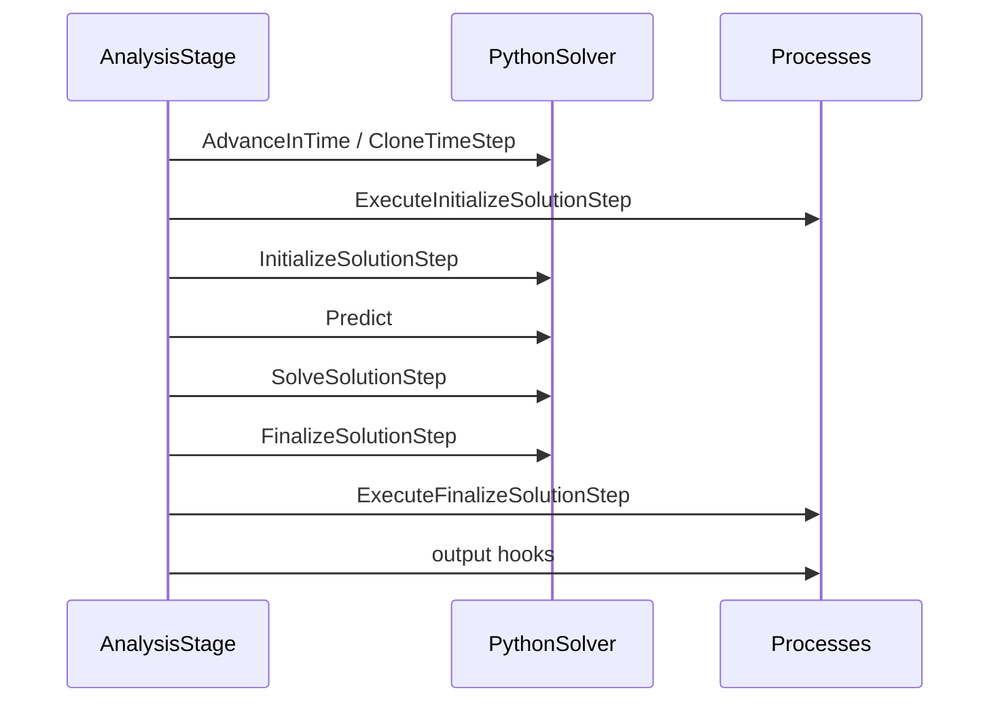

# Chapter 02 — Variables, data storage, DOFs, flags, and time buffers

Kratos has several data mechanisms that look similar from Python but have different numerical roles. For any value in a model, ask four questions:

1. What is its registered Kratos type?
2. Which entity owns it?
3. Is it historical or non-historical?
4. Is it merely stored data, or is it an algebraic degree of freedom?

The answers determine allocation, time history, equation numbering, and the API used to read or write the value.

## Run the example

```bash
python3 tutorial/02_variables_and_time/variables_and_time.py
```

## Strongly typed registered variables

`KM.TEMPERATURE` is not a string key. It is a globally registered variable object with a specific type (`double`). `KM.DISPLACEMENT` is an array-of-three variable with registered scalar components `DISPLACEMENT_X`, `_Y`, and `_Z`.

The registry prevents one component from treating a value as a scalar while another treats it as a vector. Convert from configuration strings using:

```python
variable = KM.KratosGlobals.GetVariable("TEMPERATURE")
```

An application must be imported before its application-specific variables can be retrieved.

## Historical nodal storage

Historical values participate in the solution-step buffer:

```python
model_part.AddNodalSolutionStepVariable(KM.TEMPERATURE)
node.SetSolutionStepValue(KM.TEMPERATURE, 0, 20.0)
```

Register the variable on the ModelPart **before** creating or reading nodes. The ModelPart's nodal variable list determines the memory layout allocated on every node.

After `CloneTimeStep(new_time)`, step index 0 is current, index 1 is the previous stored state, and so on. The example uses a buffer size of three and obtains `[31, 25, 20]` for current-to-oldest values.

Buffers are essential for multistep time integration, but they cost memory approximately proportional to:

```text
number of nodes × historical variable footprint × buffer size
```

Do not add large historical fields or oversized buffers without a numerical reason.

## Non-historical storage

Non-historical values have one copy:

```python
node.SetValue(KM.NODAL_AREA, 0.125)
area = node.GetValue(KM.NODAL_AREA)
```

Nodes, elements, conditions, properties, and other Kratos objects can carry non-historical typed data. Historical and non-historical databases are independent. Setting `TEMPERATURE` with `SetValue` does not update `GetSolutionStepValue(TEMPERATURE)`.

Use non-historical storage for metadata, auxiliary values without temporal history, neighborhood information, or algorithm-specific caches. Use historical storage for nodal solution variables that schemes/elements access at current or previous steps.

## DOFs and fixity

Adding storage does not add an equation unknown. A DOF is added separately:

```python
node.AddDof(KM.TEMPERATURE)
node.Fix(KM.TEMPERATURE)
```

Application solvers normally add required variables and DOFs for you. At low level, `VariableUtils.AddDofsList` adds DOFs consistently over a ModelPart and can associate a reaction:

```python
KM.VariableUtils.AddDofsList(
    [["DISPLACEMENT_X", "REACTION_X"]], model_part
)
```

Fixity is part of the algebraic boundary condition. A fixed DOF is prescribed; a stored nodal value with no DOF is just data.

## Flags

Flags such as `ACTIVE` and `TO_ERASE` are compact booleans:

```python
node.Set(KM.ACTIVE, True)
if node.Is(KM.ACTIVE):
    ...
```

They are well suited to selection/state and are distinct from typed variables. Many utilities accept a flag to select which entities to modify.

## `ProcessInfo`: state shared across a step

The ModelPart's `ProcessInfo` is passed into element and condition calculations. Typical entries include:

- `DOMAIN_SIZE`;
- `TIME` and `DELTA_TIME`;
- `STEP`;
- scheme/application switches;
- convergence or physical settings needed globally.

An `AnalysisStage` and its solver keep this data synchronized while advancing time. If you write a manual loop, you inherit that responsibility.

## Time-step sequence

For the default `AnalysisStage`, each step is conceptually:



The previous values needed by a scheme are already in the buffer when local equations are evaluated.

## Common mistakes

- Adding historical variables after nodes have been imported.
- Requesting buffer index 1 when buffer size is 1.
- Writing non-historical data and reading historical data, or the reverse.
- Calling `Fix` before adding the corresponding DOF.
- Assuming `CloneTimeStep` computes physics; it shifts/copies state, while the scheme and solver update values.
- Treating vector variables and their components as unrelated fields.

## Work through these changes

1. Add a fourth time step and observe which original value falls out of the size-three buffer.
2. Store `TEMPERATURE` in both databases with different values and print both to demonstrate independence.
3. Associate `REACTION_FLUX` with the `TEMPERATURE` DOF and inspect both variable names.
4. Double the buffer size and estimate the additional bytes per million nodes for one scalar and one 3D array variable.
5. Set `TO_ERASE` on selected nodes in a copied model and use the all-level removal API; verify submodelpart consistency.

Next: [Chapter 03 — Parameters](../03_parameters/README.md).
