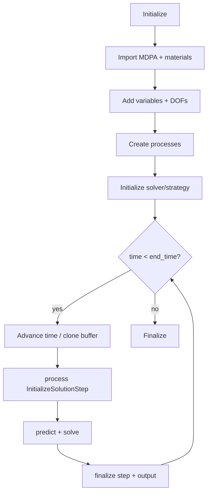

# Chapter 06 — A complete, verified structural simulation

This is the first complete application-level case. It contains the mesh, material, solver settings, constraints, load, entry point, and independent result checks. A linear bar establishes the standard workflow; a second case changes the element and strategy to solve a finite-deformation problem.

## Run the analyses

```bash
python3 tutorial/06_complete_structural_analysis/run_analysis.py
python3 tutorial/06_complete_structural_analysis/run_nonlinear_analysis.py
```

## Problem definition

A one-metre straight bar has:

```text
E = 210 GPa
A = 0.01 m²
F = 1000 N
```

Node 1 is fixed in x, y, and z. Node 2 is fixed in y and z, leaving one free axial DOF. A point-load condition applies `F` in x at node 2.

For a linear axial bar:

```text
u2 = FL/(EA) = 4.7619047619×10⁻⁷ m
R1x = -F = -1000 N
```

The script asserts both results. This is **verification**: the discrete implementation/case is checked against a known mathematical answer.

## Case files

```text
06_complete_structural_analysis/
├── README.md
├── run_analysis.py
└── case/
    ├── ProjectParameters.json
    ├── Materials.json
    └── truss.mdpa
```

### `truss.mdpa`

The MDPA defines:

- two nodes;
- one `TrussLinearElement3D2N`;
- one `PointLoadCondition3D1N` attached to node 2;
- `Supports`, `Roller`, `LoadPoint`, and `Domain` submodelparts.

Why a point-load condition as well as a nodal `POINT_LOAD` value? The value stores the load magnitude, while the condition contributes it to the global residual. Data alone does not create an equation contribution.

The example selects `TrussLinearElement3D2N`, which is distinct from the geometrically nonlinear `TrussElement3D2N`. Element choice encodes formulation assumptions; it is not a cosmetic mesh label.

### `Materials.json`

Property ID 1 receives:

- `YOUNG_MODULUS`;
- `CROSS_AREA`;
- `DENSITY`;
- `TrussConstitutiveLaw`.

The material reader finds the existing Properties object from the MDPA and populates/overwrites it. The logged warning about property ID 1 already existing describes that expected handoff.

### `ProjectParameters.json`

The major blocks are:

```text
problem_data
solver_settings
processes
output_processes
```

The static solver imports the ModelPart, imports material properties, allocates variables and DOFs, creates a static scheme and linear strategy, uses the skyline direct solver, and computes reactions.

Constraint processes address semantic groups:

- `Structure.Supports`: all displacement components fixed;
- `Structure.Roller`: y and z fixed.

The load process sets `POINT_LOAD=[1000,0,0]` on `Structure.LoadPoint`. Fixing the two transverse DOFs at node 2 is essential: an axial truss has no transverse stiffness in its undeformed linear formulation.

### `run_analysis.py`

The entry point:

1. reads Parameters;
2. creates a shared `Model`;
3. constructs `StructuralMechanicsAnalysis`;
4. calls `Run()`;
5. queries the solved ModelPart;
6. compares against closed form.

The JSON keeps short, readable relative filenames. The entry point resolves the case directory from `__file__` and replaces those two values with absolute paths before constructing the stage. It therefore works from any shell directory and does not change process-wide working-directory state.

## What `AnalysisStage.Run()` performs

At a high level:



Even a static case uses a solution-step/time-loop interface. Here one step advances from 0 to 1. This consistent lifecycle allows static, transient, coupled, restarted, and staged analyses to share orchestration.

## Linear versus nonlinear settings

`"analysis_type": "linear"` selects a single linear solve. A nonlinear element/material/problem requires a nonlinear strategy and convergence controls. Never use a linear strategy merely because it is faster if the formulation or expected deformation is nonlinear.

For nonlinear analysis, establish:

- residual and/or displacement convergence criteria;
- relative and absolute tolerances with physical meaning;
- maximum iteration behavior;
- load/time step sufficiently small for the response path;
- whether geometry is updated (`move_mesh_flag`);
- evidence of equilibrium and path independence where appropriate.

## Finite-deformation companion case

`run_nonlinear_analysis.py` uses the same topology and material but changes the domain entity to `TrussElement3D2N`, selects a Newton-Raphson nonlinear strategy, and applies a deliberately large tensile force of `1×10⁹ N`.

For stretch `λ = 1 + u/L`, this total-Lagrangian truss uses Green-Lagrange strain and a linear uniaxial constitutive response:

```text
E_G = (λ² - 1)/2
S   = E E_G
F   = A S λ
```

The last factor `λ` converts the second Piola-Kirchhoff stress result into the axial force conjugate to displacement in the reference description. The script reconstructs force from the converged displacement and checks equilibrium to relative tolerance `1×10⁻⁹`.

For this case:

```text
nonlinear displacement  = 0.313433594 m
small-strain prediction = 0.476190476 m
```

The difference is not numerical error. It is the geometric nonlinearity encoded by a different registered element and nonlinear strategy. This companion case is also a warning: “same mesh and material” does not imply “same mathematical model.”

## Interpreting logs

The startup log confirms:

- imported applications;
- entity types and counts read from MDPA;
- material import;
- variables and DOFs;
- selected linear solver;
- step/time progression.

Treat these as structured evidence. For production runs, archive logs and use an echo level that exposes important choices without overwhelming storage.

## Work through these changes

1. Double the force. Predict displacement and reaction, then update the load process.
2. Halve `CROSS_AREA`; verify the stiffness/displacement scaling.
3. Change the bar length to 2 m by moving node 2 and verify the scaling.
4. Remove the roller's z constraint and diagnose the resulting singular mode.
5. Reduce the nonlinear companion case's load by factors of ten and quantify how its displacement approaches the small-strain prediction.
6. Add a third collinear node and two elements. Show that the end displacement is unchanged for identical area/material.

Next: [Chapter 07 — Processes](../07_processes/README.md).
